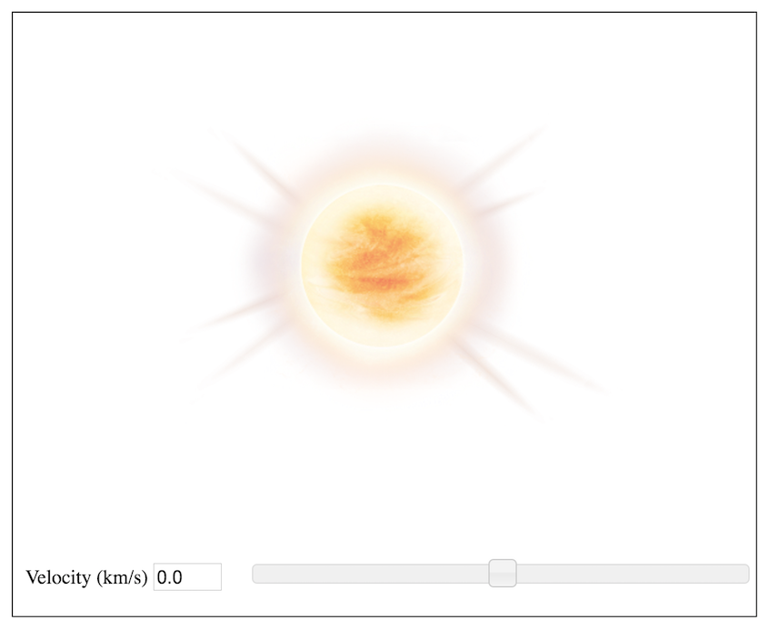

###The Dopplers Effect

Build a simulation of the Dopplers Effect from the perspective of a observer that is stationary and the velocity of the object is increasing or slowing down. 

Shown below is a Star that has a velocity of 0 km/s does not have any shift in wavelengths. However as the velocity increases, the wavelength increases and the shifts to longer wavelength spectrum of light, showing a redshit.

As the object is slowing down or moving closer to the observer who is stationary, the wavelengths is shorter and the frequency is higher, also known as the blueshift. 

Using the slider bar, the Observer can use this as a tool to explain the Doppler's shift in terms of planetary orbits and stars that are moving away from our galaxy versus the stars that are moving towards our galaxy.

####Resources:
1. [Relativistic Doppler effect](https://en.wikipedia.org/wiki/Relativistic_Doppler_effect)
2. [Abberation of Light](https://en.wikipedia.org/wiki/Relativistic_Doppler_effect#/media/File:XYCoordinates.gif)